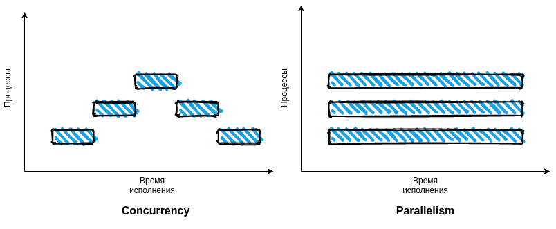
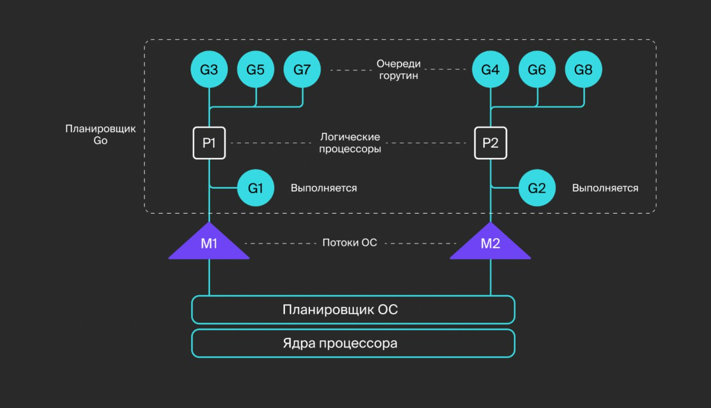
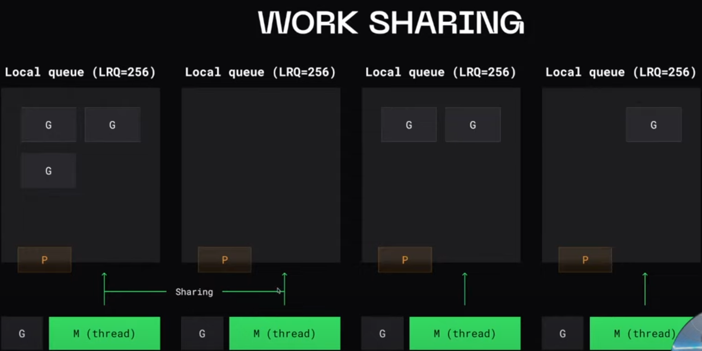
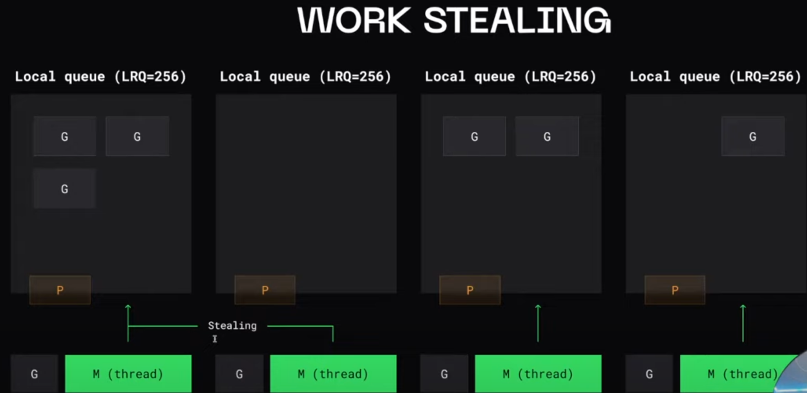
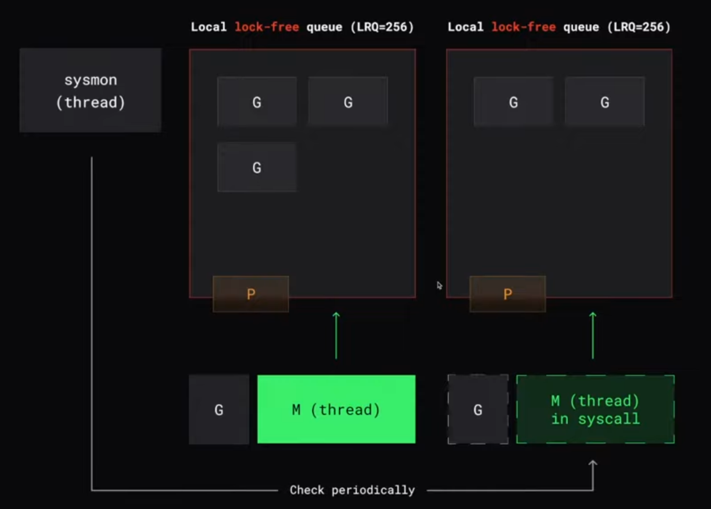
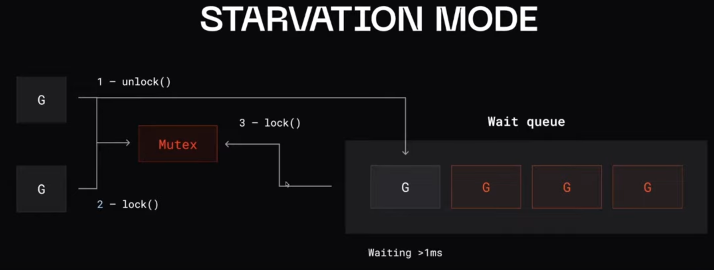

# Конкурентность и параллелизм в GO



Горутины работают в одном адресном пространстве. Следовательно, доступ к общей памяти должен быть синхронизирован. Это можно сделать через пакет sync, но это крайне не рекомендуется. Вместо этого Go использует каналы для синхронизации горутин.

Управление стеком осуществляется автоматически. Сборщик мусора не управляет стеками. Вместо этого они освобождаются сразу после выхода горутины.

Горутины могут выполняться в нескольких потоках операционной системы. Горутины имеют временной интервал в потоках ОС, поэтому некоторое количество горутин может обслуживаться меньшим числом потоков ОС.

Существуют два стиля параллелизма: детерминированный (четко определенный порядок) и недетерминированный (блокировка / взаимное исключение, но неопределенный порядок). Горутины и каналы Go продвигают детерминированный параллелизм (например, каналы с одним отправителем и одним получателем).

---

## Переключение контекста

Кооперативная многозадачность - контекст переключается в тот момент когда текущая активная задача явно объявляет о том что она готова отдать контекст другой задаче. (есть риск что будут захвачены все вычислительные ресурсы и не даст выполнятся другим задачам)

Вытесняющаяя многозадачность - задачи управляются некоторым компонентом, который принудительно может ставить одни задачи на паузу и продолжать выполнение других (может быть неэффективным переключение контекста)

В GO существуется смешенный подход (планировщиком), но работает не в режиме runtime, а во время компиляции приложения.
Компилятор расставляет метки для переключения контекста в различным местах программы, основываясь на некоторых эвристиках о том что в таких местах программа скорее всего будет заблокирована.

Переключение контекста обычно происходит в местах:

- операции с сетью
- системные вызовы
- вызовы функций
- блокировки

> runtime.Goshed() - явно переключится на выполнение другой горутины

## Синхронизация потоков

- chan

## Синхронизация доступа к данным

Примитивы синхронизации:

- Mutex
- RWMutex
- Atomic - атомарные счетчики (низкоуровненвые примитивы синхронизации)
- sync.Map
- WaitGroup
- sync.Poll
- sync.Cond

### Mutex

1. Не встаривать Mutex в структуру:

```go
type MyStruct strcut {
    sync.Mutex
}
```

При встраивании Mutex станет экспортируемым полем и будет доступен публично.

2. Не хранить ссылку на Mutex в поле структуры

```go
type MyStruct strcut {
    mu *sync.Mutex
}
```

Во всех копиях структуры будет храниться указатель на один и тот же Mutex

3. Методы которые блокируют и разблокируют Mutex должны иметь ссылчной ресивер

```go
func (m MyStruct) A() {
    m.Lock()
}
```

Mutex будет заблокирован в копии структуры, а не в том экземпляре у коготорого был вызван метод

4. RWMutex

```gp
mu sync.RWMutex
```

Эксклюзивные блокировки отдельно на чтение и отдельно на запись

## Состояние гонки

### race detector

```go
--race
```

### Локальная очереди

Local lock-free queue (LRQ=256)



#### Когда в очереди закончились горутины

Work sharing - потоки шарят определенные горутины между собой


Work stealing - пустые потоки (без контекста) будут красть горутины


- Нужна синхронизация (-)
- Красть из рандомной очереди
- Попытаться украсть 4 раза
- Красть половину - чтобы минимизировать конфликт и синхронизацию

256 горутин в очереди

## SYSCALLS

Голодание - когда горутины никто не выполняет. При `SYSCALL` происходит прокировка потока ОС.

### Handoff

Планировщик GO сразу открепляет потом (М) от процессора (Р), если понимает, что поток будет заблокирован на системной вызове в течении долгого времени.
>В других случаях (short-lived syscalls) он позволит потоку быть заблокированным и не будет откреплять его от процессора.



Но иногда поток может оставаться заблокированным долгое время.
Тогда **sysmon** проверяет, находится ли потом еще в `SYSCALL` и если да, то `sysmon` открепляет поток от процессора, создается новый потом и к нему прикрепляется процессор.

## Очереди в планировщике GO

https://youtu.be/P2Tzdg8n9hw?si=F2GkpPsQV-mOEKci&t=2443

### Глобальная очередь

После выполнения SYSCALL горутина добавляется в очередь того процессора, где она была. Если процессор недоступен (полненоа локальная очередь или он занят другим syscall) то ищем другой процессор.
>Если не нашлось доступных процессоров, то добавляем горутину в глобальную очередь (с `mutex`).

Чтобы горутины в глобальной очереди не голодали, 1/61 тиков планировщика горутины беруться из глобальной очереди.
>1/61 - число которое будет приводить к редким конфликтам

### Очередь ожидания (wait group)

Заблокированные горутины (Mutex, SysCall) вытесняются в очередь ожидания.

 

## NetPoller (мультиплексор)

Т.к. системыне вызовы wtite/read являются блокирующими вызоывами

Когда создается сетевое соединение (сокет), создается файл-дескриптом, он добавляется в мультиплесор, который отслеживает изменения сокетов. Когда будут доступны данные, горутина разблокируется и возвращается по принципу **handoff**

## Асинхронная вытесняющая многозадачность (Asynchronous preemption)

Если есть горутина, работающая более 10мс, в поток передается сигнал для ее вытяснния (SIGUGR). Этим занимается **sysmon**.
>Горутина может вытясниться не сразу, если она находится в unsafe pointer.
